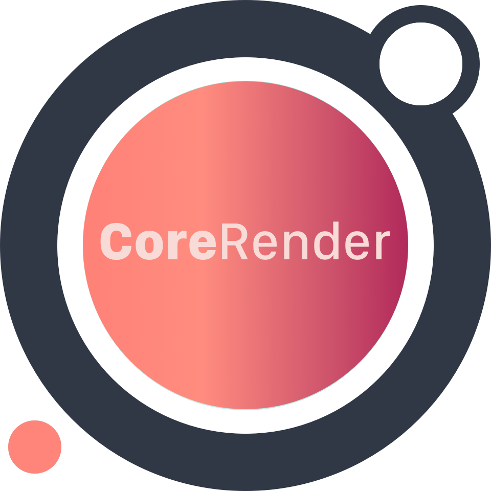

# CoreRender [](#) [](#) [](https://opensource.org/licenses/MIT)



CoreRender is a SwiftUI inspired API for UIKit (that is compatible with iOS 11+ and ObjC).

### Introduction

* **Declarative:** CoreRender uses a declarative API to define UI components. You simply describe the layout for your UI based on a set of inputs and the framework takes care of the rest (*diff* and *reconciliation* from virtual view hierarchy to the actual one under the hood).
* **Flexbox layout:** CoreRender includes the robust and battle-tested Facebook's [Yoga](https://facebook.github.io/yoga/) as default layout engine.
* **Fine-grained recycling:** Any component such as a text or image can be recycled and reused anywhere in the UI.

### TL;DR

Let's build the classic *Counter-Example*.

The following is the node hierarchy definition.

```swift
func counterNode(ctx: Context) -> ConcreteNode<UIView> {
  struct Key {
    static let counterRoot = "counterRoot"
  }
  // Retrieves the root node controller.
  let controllerProvider = ctx.controllerProvider(type: CounterController.self, key: Key.counterRoot)

  // Returns the node hiearchy.
  return Node(UIView.self) {
    // A child.
    Node(UILabel).withLayoutSpec { spec
      Property(in: spec, keyPath: \.text, value: "Hello!")
    }
    // Another child.
    Node(UILabel.self).withLayoutSpec { spec in
      let count = controllerProvider?.controller.state.count ?? 0
      Property(in: spec, keyPath: \.text, value: "count: \(count)")
    }
  }
  // Binds a controller with a unique key.
  .withControllerType(CounterController.self, key: Key.counterRoot, initialState: CounterState(), props: NullProps.null)
  // Container view configuration.
  .withLayoutSpec { spec in
      ctx.set(spec, keyPath: \.yoga.width, value: spec.size.width)
      ctx.set(spec, keyPath: \.backgroundColor, value: .lightGray)
      ctx.set(spec, keyPath: \.cornerRadius, value: 5)
  }.build()
}
```

*Controllers* are similar to Components in React/Render/Litho and Coordinators in SwiftUI.

```swift
class CounterController: Controller<NullProps, CounterState> {

  func incrementCounter() {
    self.state.count += 1 .              // Update the state.
    print("count: \(self.state.count)")
    nodeHierarchy?.setNeedsReconcile()   // Trigger the reconciliation algorithm on the view hiearchy associated to this controller.
  }
}

class CounterState: State {
  var count = 0;
}
```

Finally let's create *CoreRender* node hiararchy in our ViewController.

```swift
class CounterViewController: UIViewController {
  private var nodeHierarchy: NodeHierarchy?
  private let context = Context()

  override func viewDidLoad() {
    super.viewDidLoad()
    nodeHierarchy = NodeHierarchy(context: context) { ctx in
      counterNode(ctx: ctx)
    }
    nodeHierarchy?.build(in: view, constrainedTo: view.bounds.size, with: [.useSafeAreaInsets])
  }

  override func viewDidLayoutSubviews() {
    nodeHierarchy?.setNeedsLayout()
  }
}
```
