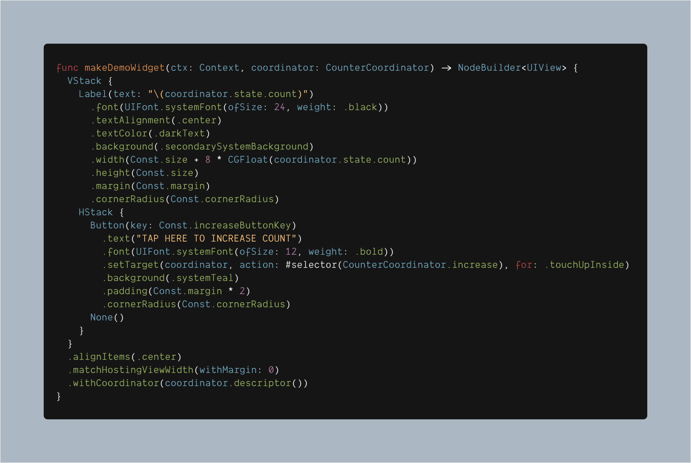
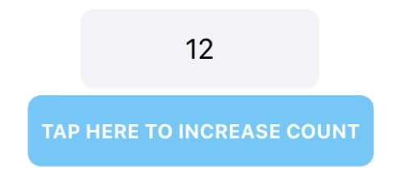

# CoreRender [](#) [](#) [](https://opensource.org/licenses/MIT)


CoreRender is a SwiftUI inspired API for UIKit (that is compatible with iOS 10+ and ObjC).






### Introduction

* **Declarative:** CoreRender uses a declarative API to define UI components. You simply describe the layout for your UI based on a set of inputs and the framework takes care of the rest (*diff* and *reconciliation* from virtual view hierarchy to the actual one under the hood).
* **Flexbox layout:** CoreRender includes the robust and battle-tested Facebook's [Yoga](https://facebook.github.io/yoga/) as default layout engine.
* **Fine-grained recycling:** Any component such as a text or image can be recycled and reused anywhere in the UI.

### TL;DR

Let's build the classic *Counter-Example*.

The following is the node hierarchy definition.

```swift
func makeCounter(ctx: Context, coordinator: CounterCoordinator) -> ConcreteNode<UIView> {
  VStack {
    Label(text: "count \(coordinator.state.count)").build()
    Button(title: "Increse", action: {
        coordinator.increase()
    })
  }
}
```

`Label` and `Button` are just specialized versions of the `Node<V: UIView>` pure function.
That means you could wrap any UIView subclass in a vdom node. e.g.
```swift

Node(type: UIScrollView.self) {
  Node(type: UILabel.self).withLayoutSpec { spec in 
    // This is where you can have all sort of custom view configuration.
  }.build()
  Node(type: UISwitch.self).build()
}

```
The `withLayoutSpec` modifier allows to specify a custom configuration closure for your view.


*Coordinators* are similar to Components in React/Render/Litho and Coordinators in SwiftUI.

```swift
class CounterCoordinator: Coordinator<CounterState, NullProps> {

  func incrementCounter() {
    self.state.count += 1                // Update the state.
    body?.setNeedsReconcile()            // Trigger the reconciliation algorithm on the view hiearchy associated to this coordinator.
  }
}

class CounterState: State {
  var count = 0;
}
```

Finally let's create *CoreRender* node hiararchy in our ViewCoordinator.

```swift
class CounterViewCoordinator: UIViewController {
  private let context = Context()
  private var hostingView: HostingView {
    view as! HostingView
  }
  var coordinator: CounterCoordinator {
    context.coordinator(makeCoordinatorDescriptor(CounterCoordinator.self).toRef())
      as! CounterCoordinator
  }
  
  func loadView() {
    view = HostingView(context: context, options: [.useSafeAreaInsets]) { ctx in
      makeCounter(ctx: ctx, coordinator: coordinator)
    }
  }
  
  override func viewDidLayoutSubviews() {
    hostingView.setNeedsLayout()
  }
}
```
